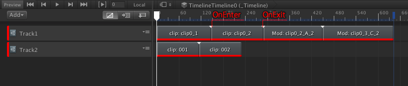

# TimelineEvent

~~~cs
public class EventExtraPlayableAsset : EventPlayableAssetBase
{
    public enum ContentType
    {
        A, B, C
    }

    public int additionalValue = 2;
    public ContentType contentType = ContentType.A;

    public override string GetEditorDisplayName() {
        return "Mod: " + clipName + "_" +contentType + "_" + additionalValue;
    }
}
~~~

~~~cs
public class TimelineEventSample : TimelineEventBase
{
    [SerializeField] Text debugText;

    public override void OnEnter(string track, EventPlayableAssetBase asset) {
        string str = "";
        str += "OnEnter: " + asset._name;
        if (asset is EventExtraPlayableAsset) {
            str += "_Type: " + ((EventExtraPlayableAsset)asset).contentType;
        }
        debugText.text = track + " / " + str;
    }

    public override void OnExit(string track, EventPlayableAssetBase asset) {
        string str = "";
        str += "OnExit: " + asset._name;
        debugText.text = track + " / " + str;
    }
}

~~~
